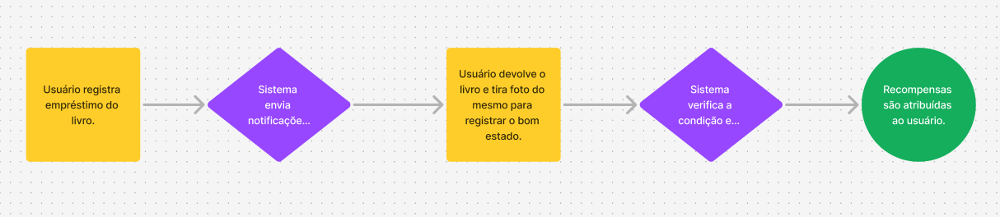
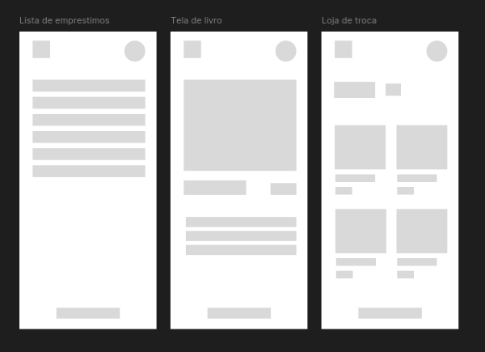

# Projeto - Desenvolvimento Aplicativo Android - PDM

## Disciplina: Programação de Dispositivos Móveis  
**Professor:** Gustavo Wagner Diniz Mendes  
**Alunos:** Lucas Andrade, Johnner Yelcde e Ândrei de Medeiros  

---

# Book Back

## 1. Descrição Detalhada do Problema  
Atualmente, bibliotecas enfrentam um problema recorrente: a baixa taxa de devolução de livros no prazo estipulado. Essa situação não apenas reduz a disponibilidade de materiais para outros leitores, mas também pode gerar prejuízos financeiros e desgaste nos acervos devido ao atraso e danos causados aos livros. Muitas vezes, os usuários não têm um incentivo claro para respeitar as datas de devolução, o que perpetua esse problema.

## 2. Solução Proposta  
Propomos um aplicativo gamificado que incentiva a devolução de livros no prazo correto. O aplicativo oferecerá "moedas virtuais" para os leitores que devolverem os livros pontualmente e em boas condições. Essas moedas poderão ser acumuladas e trocadas por brindes.  

### Principais funcionalidades:
- Registro e controle de empréstimos.
- Notificações para lembrar a data de devolução.
- Sistema de recompensas por boas práticas.
- Uso da câmera para tirar fotos do livro antes da devolução, indicando seu bom estado.
- Banco de dados local (Room) para armazenamento temporário.
- Integração com Google Firestore para salvar o histórico dos livros já lidos.
- Experiência responsiva e acessível, com design moderno baseado em Material Design.

## 3. Arquitetura  
Optamos por uma arquitetura baseada em **MVVM (Model-View-ViewModel)** para garantir manutenção fácil e escalabilidade do aplicativo.

### **Componentes principais:**
- **Camada de Dados:**
  - Banco de dados local: Room para armazenamento temporário.
  - Banco de dados em nuvem: Google Firestore.
  - APIs REST para serviços externos.
- **Camada de Domínio:**
  - Regras de negócio encapsuladas.
  - Casos de uso para interações específicas (ex.: calcular recompensas).
- **Camada de Apresentação:**
  - Jetpack Compose para criar interfaces reativas.
  - ViewModel para gerenciar estados e dados da interface.
- **Integrações:**
  - Câmera para tirar fotos do livro.

## 4. Diagrama  

## 5. Wireframe  

